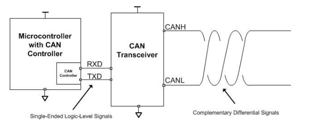
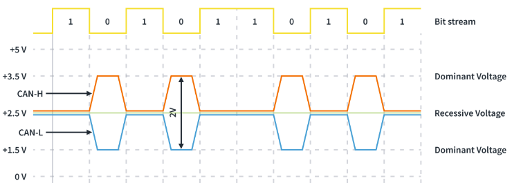
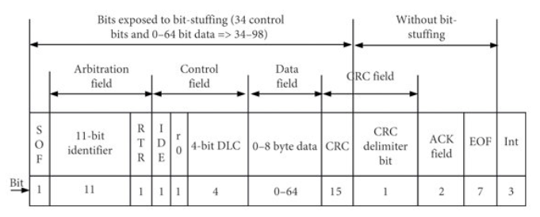
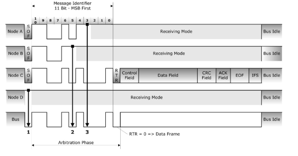
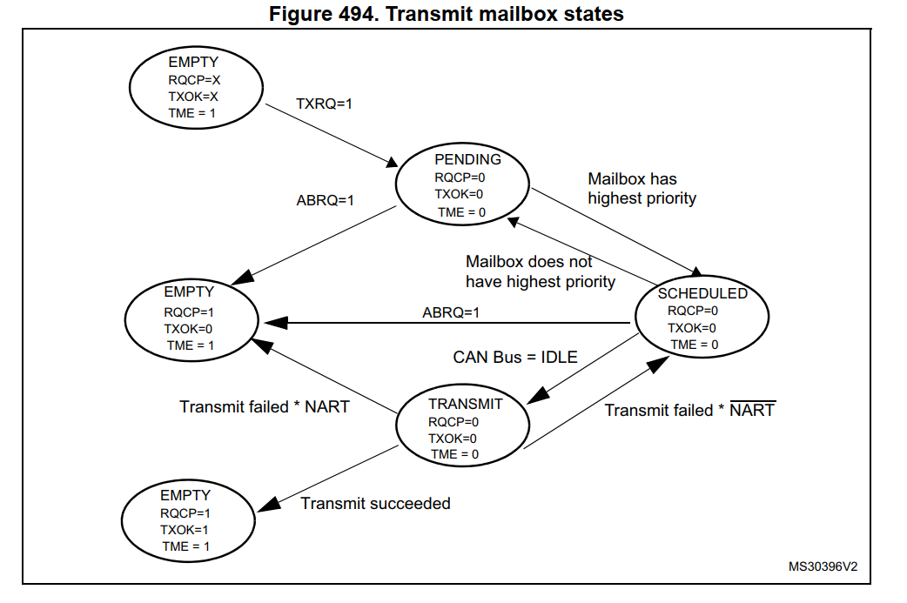
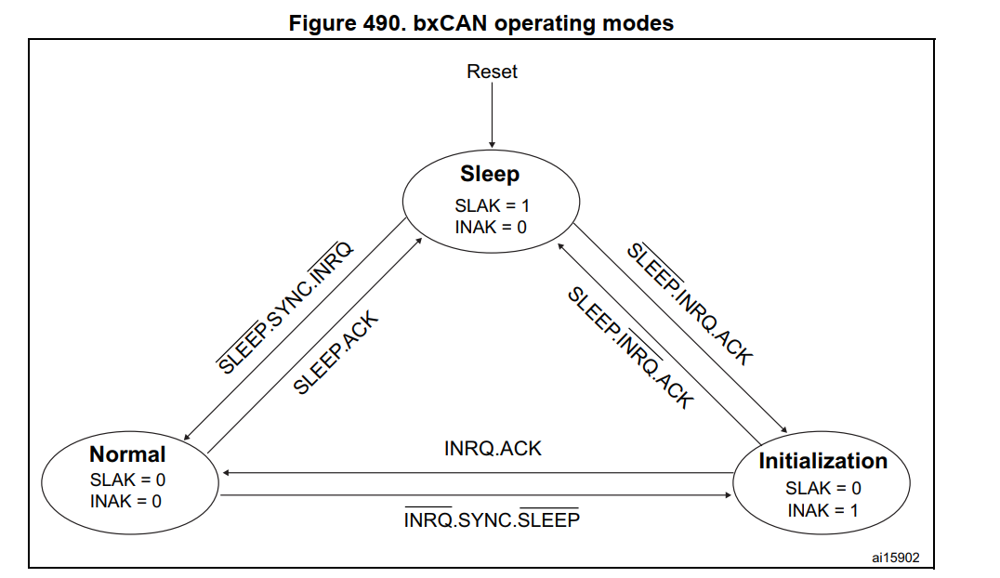
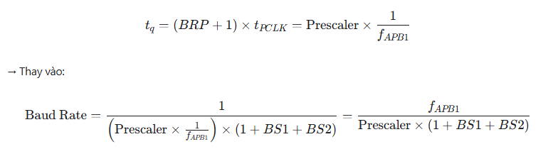
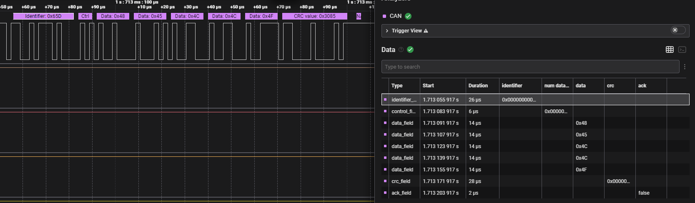
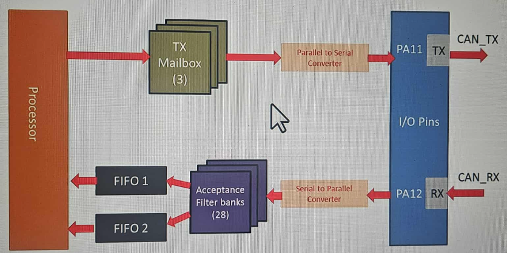

# Can protocol

# 1. Overview

- CAN (Controller Area Network) is a robust vehicle bus standard designed to allow microcontrollers and devices to communicate with each other without a host computer. It is widely used in automotive and industrial applications due to its reliability and efficiency.
- CAN offfers data rates up to 1 Mbps and supports real-time communication.
- The Error Detection and Fault Confinement features of CAN make it suitable for safety-critical applications.

# 2. Features

- Low cost and high reliability.
- Extremely robust against electrical interference.
- High-speed communication (up to 1 Mbps).
- Automatic retransmission of corrupted messages.
- It's a broadcast communication protocol where all nodes on the network can see all messages. (not like point-to-point communication such as UART, SPI, I2C, USB, Ethernet, etc. )

# 3. Features

- CAN controller, Transceiver

- Can Differential Signaling
    - Recessive State: potential difference on both CAN_H and CAN_L lines is 0V (recessive bit = 0)
    - Dominant State: potential difference on CAN_H and CAN_L lines is ~2V (dominant bit = 1)

# 4. CAN Frame Format

- Thera are four types of CAN frames:
    - Data Frame: Carries data from a transmitter to the receivers.

        - Start of Frame (SOF): Indicates the beginning of a frame.
        - Identifier: Unique ID for the message, used for arbitration.
        - Control Field: Contains information about the data length.
        - Data Field: Contains the actual data being transmitted (0-8 bytes).
        - CRC Field: Error-checking code to ensure data integrity.
        - Acknowledgment (ACK) Field: Indicates whether the message was received correctly.
        - End of Frame (EOF): Marks the end of the frame.

    - Remote Frame: Requests data from a specific node.
    - Error Frame: Signals an error condition on the bus.
    - Overload Frame: Provides extra delay between data or remote frames.

- Standard CAN Frame vs Extended CAN Frame
    - Standard CAN Frame: Uses an 11-bit identifier.
    - Extended CAN Frame: Uses a 29-bit identifier.

- ACK bit: It just mean that if any node receives the message correctly, it will overwrite the recessive bit with a dominant bit in the ACK slot to inform the transmitter that the message was received successfully. If Transmitter does not see a dominant bit in the ACK slot then it retransmits the message until it receives an ACK or reaches the maximum number of retransmissions.

- Bus Arbitration
    - When multiple nodes attempt to transmit simultaneously, the node with the highest priority (lowest identifier value) wins arbitration and continues transmitting, while others back off and wait.

# 5. CAN Modes
- Normal Mode:
    - In Normal Mode, the CAN controller operates in its standard mode, allowing it to both transmit and receive messages on the CAN bus.
    - This mode is used for regular communication between nodes on the network.
    
- Silent Mode: 
    - In Silent Mode, the CAN controller can receive messages but does not transmit any messages on the bus. This mode is useful for monitoring bus traffic without interfering with communication.
    - CAN TX is held at recessive level, TX line is internally looped back to RX line.

- Loopback Mode:
    - In Loopback Mode, the CAN controller internally loops back transmitted messages to its own receiver.
    - This mode is primarily used for testing and debugging purposes, allowing developers to verify the functionality of the CAN controller without needing an external CAN bus.
    - CAN TX is internally looped back to RX line, no physical transmission on the bus.

- Silent Loopback Mode:
    - In this mode, the CAN controller internally loops back transmitted messages to its own receiver without transmitting them on the bus.
    - This mode is useful for testing and debugging while ensuring that no messages are sent on the actual CAN bus.

# 6. bx Block Diagram (Tx path)

- Three transmit mailboxes are provided to the software for setting up messages.
- The transmission Scheduler decides which mailbox has to be transmitted first.
- In order to transmit a message, the application must select one empty transmit mailbox, set up the identifier, the data length code (DLC) and the data before requesting the transmission.
- Request Transmission by setting TXRQ bit in the control register.
- Immediately after the TXRQ bit has been set, the mailbox enters pending state and waits to become the highest priority mailbox.
- As soon as the mailbox has the highest priority it will be scheduled for transmission.
- The transmission of the message of the scheduled mailbox will start (enter transmit state) when the CAN bus becomes idle.
- Once the mailbox has been successfully transmitted, it will become empty again.
- The hardware indicates a successful transmission by setting the RQCP and TXOK bits in the CAN_TSR register.
- If the transmission fails, the cause is indicated by the ALST bit in the CAN_TSR register in case of an Arbitration Lost, and/or the TERR bit, in case of transmission error detection.

# 7. bx operating modes

# 8. Bit timing

- CAN Baud Rate: The speed at which data is transmitted on the CAN bus, measured in bits per second (bps).
- Time Quanta (TQ): The smallest unit of time used in CAN bit timing. The bit time is divided into multiple time quanta.
- f_APB1: The frequency of the APB1 peripheral bus clock.
- Prescaler (BRP): A value that divides the APB1 clock frequency to generate the time quanta.
- (1 + BS1 + BS2): Total number of Time Quanta (TQ) in one CAN bit time.
- 1: Sync Segment (SS) Always 1 TQ. Used to synchronize all nodes on the bus when a falling edge (start of frame) is detected.
- BS1:  Bit Segment 1: Number of TQ allocated for propagation delay compensation and the first part of the bit time
- BS2: Bit Segment 2: Number of TQ allocated for phase adjustment and the last part of the bit time.

**Example: Calculate CAN Bit Timing Parameters**

- Given:
    - f_APB1 = 16 MHz
    - Prescaler (BRP) = 2
    - BS1 = 13
    - BS2 = 2

- Calculate the CAN Baud Rate:  
   CAN Baud Rate = 16,000,000 / (2 * (1 + 13 + 2)) = 500,000 bps

- Use [link](http://www.bittiming.can-wiki.info/) to calculate the bit timing parameters.

**Example 1 Data frame message format (standard ID)**

# 9. Rx block diagram

- bxCAN RX Path
    - Two receive FIFOs are used by each CAN Controller to store the incoming messages.
    - Three complete messages can be stored in each FIFO.
    - The FIFOs are managed completely by hardware.

- RX filtering 
    - The controller will read any frames it sees on the bus and hold them in a small FIFO memory. It will notify the host processor that this data is available, which the processor then reads from the controller.
    - The controller also contains a hardware filter mechanism that can be programmed to ignore and discard those CAN frames you do not want passed to the processor. This saves processor overhead.
    - Acceptance filtering is introduced to manage the frame reception.

- Acceptance filtering
    - There are 28 filter banks shared between Master bxCAN (CAN1) and slave bxCAN (CAN2).
    - Each Filter bank has 2, 32-bit associated filter registers.
    - You can use filter banks to filter the incoming messages

## 10. CAN ỉnterrupts

- Transmit interrupt: Transmit mailbox empty
- FIFO 0 interrupt : Reception of a new message, FIFO full condition, FIFO overrun condition
- Error and status change interrupt: Error condition, Wake-up condition, Entry into Sleep mode.

