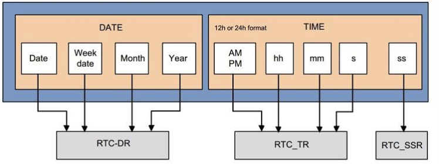
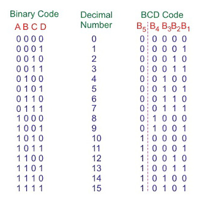

# Real time clock (RTC)

# 1. Introduction

- The Real-Time Clock (RTC) is a specialized hardware module in microcontrollers that keeps track of the current time and date, even when the main system is powered off. It is commonly used in applications that require accurate timekeeping, such as data logging, alarms, and scheduling tasks.

# 2. Features of RTC

- Calendar with sub-seconds, seconds, minutes, hours (12 or 24-hour format), day of the week, date, month, and year
- Two programmable alarms with interrupt function. The alarms can be set to trigger by any combination of calendar fields.
- The RTC calendar is provided with a binary or BCD format.

# 3. RTC calendar feild

# 4. BCD format and Binary format

